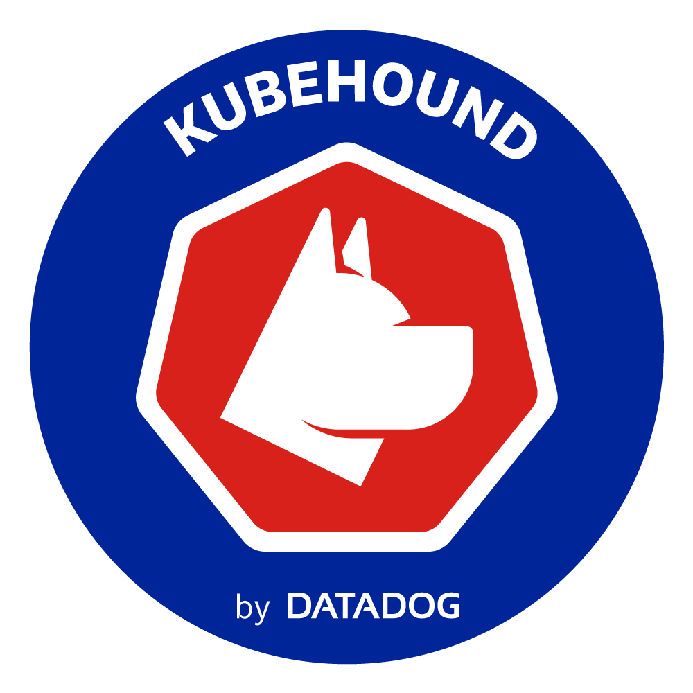
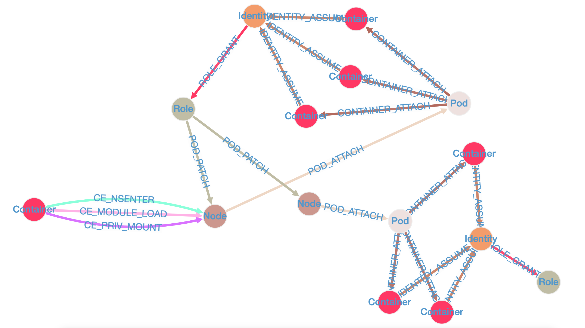

# KubeHound

<p align="center">
  
</p>
A Kubernetes attack graph tool allowing automated calculation of attack paths between assets in a cluster.

## Quick Start

Select a target Kubernetes cluster, either:
* Using [kubectx](https://github.com/ahmetb/kubectx)
* Using specific kubeconfig file by exporting the env variable: `export KUBECONFIG=/your/path/to/.kube/config`

Download binaries are available for Linux / Windows / Mac OS via the [releases](https://github.com/DataDog/KubeHound/releases) page or by running the following (Mac OS/Linux):
```bash
wget https://github.com/DataDog/KubeHound/releases/download/latest/kubehound-$(uname -o | sed 's/GNU\///g')-$(uname -m) -O kubehound
chmod +x kubehound
```

<details>
<summary>MacOS Notes</summary>

If downloading the releases via a browser you must run e.g `xattr -d com.apple.quarantine kubehound` before running to prevent [MacOS blocking execution](https://support.apple.com/en-gb/guide/mac-help/mchleab3a043/mac)

</details>


Then, simply run
```bash
./kubehound
```
<details>
<summary>To build KubeHound from source instead</summary>

Clone and build this repository:
```bash
git clone https://github.com/DataDog/KubeHound.git
cd KubeHound
make kubehound
```

The built binary is now available at:
```bash
bin/build/kubehound
```
</details>

For more advanced use case and configuration, see [ADVANCED.md](./ADVANCED.md)
To view the generated graph see the [Using KubeHound Data](#using-kubehound-data) section.

## Sample Attack Path



## Requirements

To run KubeHound, you need a couple dependencies
+ [Docker](https://docs.docker.com/engine/install/) `>= 19.03` 
+ [Docker Compose](https://docs.docker.com/compose/compose-file/compose-versioning/) `V2`

### Sample Data

To view a sample graph demonstrating attacks in a very, very vulnerable cluster you can generate data via running the app against the provided kind cluster:

```bash
make sample-graph
```

To view the generated graph see the [Using KubeHound Data](#using-kubehound-data) section. 

## Using KubeHound Data

To query the KubeHound graph data requires using the [Gremlin](https://tinkerpop.apache.org/gremlin.html) query language via an API call or dedicated graph query UI. A number of fully featured graph query UIs are available (both commercial and open source), but we provide an accompanying Jupyter notebook based on the [AWS Graph Notebook](https://github.com/aws/graph-notebook),to quickly showcase the capabilities of KubeHound. To access the UI:

+ Visit [http://localhost:8888/notebooks/KubeHound.ipynb](http://localhost:8888/notebooks/KubeHound.ipynb) in your browser
+ Use the default password `admin` to login (note: this can be changed via the [Dockerfile](./deployments/kubehound/notebook/Dockerfile) or by setting the `NOTEBOOK_PASSWORD` environment variable in the [.env](./deployments/kubehound/.env.tpl) file)
+ Follow the initial setup instructions in the notebook to connect to the KubeHound graph and configure the rendering
+ Start running the queries and exploring the graph!

### Example queries

We have documented a few sample queries to execute on the database in [our documentation](https://kubehound.io/queries/gremlin/).

### Query data from your scripts

#### Python

You can query the database data in your python script by using the following snippet:

```python
#!/usr/bin/env python
import sys
from gremlin_python.driver.client import Client

KH_QUERY = "kh.containers().count()"
c = Client("ws://127.0.0.1:8182/gremlin", "kh")
results = c.submit(KH_QUERY).all().result()
```

You'll need to install `gremlinpython` as a dependency via: `pip install gremlinpython`

## Further information

+ For an overview of the application architecture see the [design canvas](./docs/Architecture.excalidraw)
+ To see the attacks covered see the [edge definitions](./docs/reference/attacks)
+ To contribute a new attack to the project follow the [contribution guidelines](./CONTRIBUTING.md)

## Acknowledgements

KubeHound was created by the Adversary Simulation Engineering (ASE) team at Datadog:

+ Jeremy Fox [@0xff6a](https://www.twitter.com/0xff6a)
+ Julien Terriac
+ Edouard Schweisguth [@edznux](https://www.twitter.com/edznux)

With additional support from:

+ Christophe Tafani-Dereeper [@christophetd](https://twitter.com/christophetd)

We would also like to acknowledge the [BloodHound](https://github.com/BloodHoundAD/BloodHound) team for pioneering the use of graph theory in offensive security and inspiring us to create this project. 
