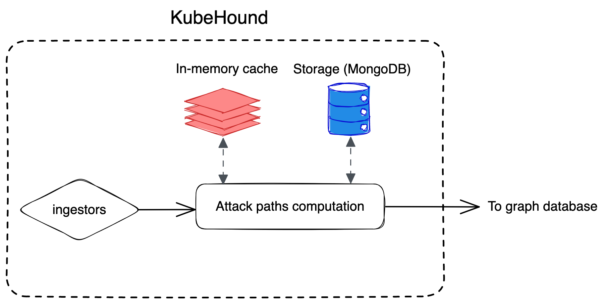

# Architecture

KubeHound works in 3 steps:

1. Connect to your Kubernetes cluster and read API resources (pods, nodes, permissions...)
2. Compute attack paths
3. Write the results to a local graph database (JanusGraph)

After the initial ingestion is done, you use a compatible client  or the provided [Jupyter Notebook](../../deployments/kubehound/notebook/KubeHound.ipynb) to visualize and query attack paths in your cluster.

Under the hood, KubeHound leverages a caching and persistence layer (Redis and MongoDB) while computing attack paths. As an end user, this is mostly transparent to you.

