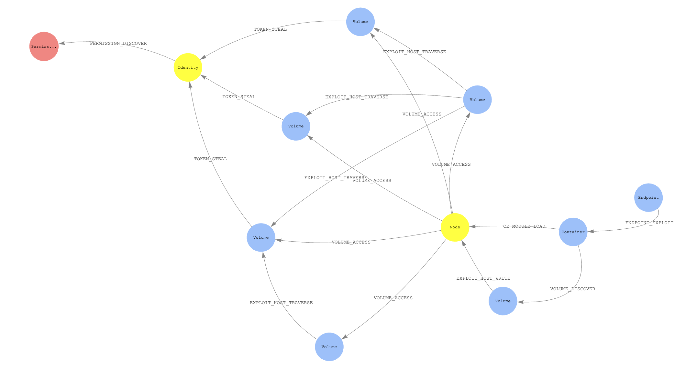

# Home 

Welcome to the KubeHound documentation!

  

KubeHound creates a graph of attack paths in a Kubernetes cluster, allowing you to identify direct and multi-hop routes an attacker is able to take, visually or through complex graph queries.

*A KubeHound graph showing attack paths between pods, nodes, and identities (click to enlarge)*

KubeHound can identify more than [25 attacks](https://kubehound.io/reference/attacks/), from container escapes to lateral movement.

After it has ingested data from your cluster, it can easily answer advanced questions such as:

- What are all possible container escapes in the cluster?
- What is the shortest exploitable path between a publicly-exposed service and a cluster administrator role?
- Is there an attack path from a specific container to a node in the cluster?

KubeHound was built with efficiency in mind and can consequently handle very large clusters. Ingestion and computation of attack paths typically takes a few seconds for a cluster with 1'000 running pods, 2 minutes for 10'000 pods, and 5 minutes for 25'000 pods. 

Next steps:

- Learn more about KubeHound [architecture](./architecture.md) and [terminology](./terminology.md)
- [Get started](./user-guide/getting-started.md) using KubeHound