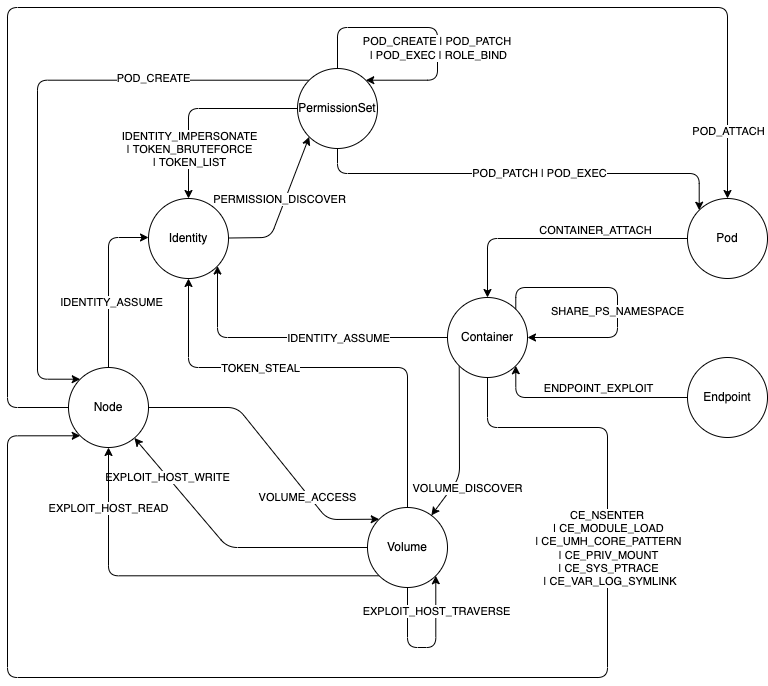

---
hide:
  - toc
---

# Reference

## Graph model

In the diagram below, you can see how the KubeHound graph model organizes entities 
as nodes and attack paths as the edges that connect them. This structure not only 
makes it easier to visualize the attack surface but also powers Gremlin queries 
to actively explore and analyze security weaknesses across your Kubernetes 
infrastructure.

## Graph Database

- [JanusGraph schema](https://github.com/DataDog/KubeHound/blob/main/deployments/kubehound/graph/kubehound-db-init.groovy)
- [Programmatically parsable schema](graph.yaml)
