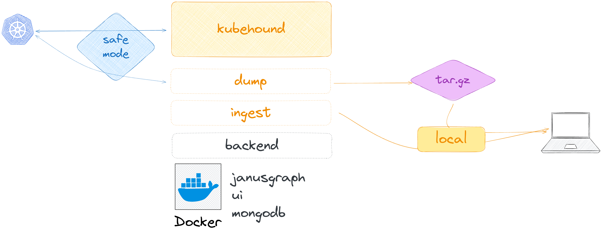

# Local Common Operations

When running `./kubehound`, it will execute the 3 following action:

* run the `backend` (graphdb, datadb and UI)
* `dump` the kubernetes resources needed to build the graph
* `ingest` the dumped data and generate the attack path for the targeted Kubernetes cluster.

All those 3 steps can be run separately.

[](../images/kubehound-local-commands.png)

!!! Note
    if you want to skip the interactive mode, you can provide `-y` or `--non-interactive` to skip the cluster confirmation.

## Backend

In order to run, KubeHound needs some docker containers to be running. Every commands has been embedded into KubeHound to simplify the user experience. You can find all the docker-compose used [here](https://github.com/DataDog/KubeHound/tree/main/deployments/kubehound).

### Starting the backend

The backend stack can be restarted by using:
```bash
kubehound backend up
```

It will use the latest [kubehound images releases](https://github.com/orgs/DataDog/packages?repo_name=KubeHound)

### Restarting/stopping the backend

The backend stack can be restarted by using:
```bash
kubehound backend reset
```

or just stopped:
```bash
kubehound backend down
```

These commands will simply reboot backend services, but persist the data via docker volumes.

### Wiping the database

The backend data can be wiped by using:

```bash
kubehound backend wipe
```

!!! Warning
    This command will **wipe ALL DATA and will not be recoverable**.

## Dump

### Create a dump localy with all needed k8s resources

For instance, if you want to dump a configuration to analyse it later or just on another computer, KubeHound can create a self sufficient dump with the Kubernetes resources needed. By default it will create a `.tar.gz` file with all the dumper k8s resources needed.

```bash
kubehound dump local [directory to dump the data]
```

If for some reasons you need to have the raw data, you can add `--no-compress` flag to have a raw extract.

!!! Note
    This step does not require any backend as it only automate grabbing k8s resources from the k8s api.

## Ingest

### Ingest a local dump

To ingest manually, an extraction made by KubeHound, just specific where the dump is being located and the associated cluster name.

```bash
kubehound ingest local [directory or tar.gz path] --cluster <cluster_name> 
```

!!! Warning
    This step requires the backend to be started, it will start it for you.
