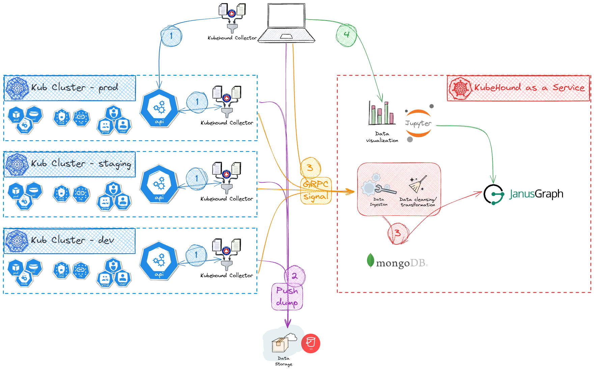

# KubeHound as a Service (KHaaS)

KHaaS enables you to use KubeHound in a distributive way. It is being splitted in 2 main categories:

- The ingestor stack which includes the `graphdb`, `storedb`, `UI` and `grpc endpoint`.
- The collector (the kubehound binary) which will dump and send the k8s resources to the KHaaS `grpc endpoint`.

[](../images/khaas-architecture.png)

!!! note

    You need to deploy the data storage you want to use ([AWS s3 in our example](https://github.com/DataDog/KubeHound/tree/main/deployments/terraform)).

## Deploying KHaaS - Ingestor stack

### Docker deployment

To run the KubeHound as a Service with `docker` just use the following [compose files](https://github.com/DataDog/KubeHound/tree/main/deployments/kubehound):

```bash
cd ./deployments/kubehound
docker compose -f docker-compose.yaml -f docker-compose.release.yaml -f docker-compose.release.ingestor.yaml up -d
```

By default the endpoints are only exposed locally:

- `127.0.0.1:9000` for ingestor endpoint.
- `127.0.0.1:8888` for the UI.

!!! warning

    You should change the default password by editing `NOTEBOOK_PASSWORD=<your_password>` in the `docker-compose.yaml`

### k8s deployment

To run the KubeHound as a Service on Kubernetes just use the following [helm files](https://github.com/DataDog/KubeHound/tree/main/deployments/k8s):

```bash
cd ./deployments/k8s
helm install khaas khaas --namespace khaas --create-namespace
```

If it succeeded you should see the deployment listed:

```bash
$ helm ls -A
NAME    NAMESPACE       REVISION        UPDATED                                 STATUS          CHART              APP VERSION
khaas   khaas           1               2024-07-30 19:04:37.0575 +0200 CEST     deployed        kubehound-0.0.1
```

!!! warning

    This is an example to deploy KubeHound as a Service in k8s cluster, but you will need to adapt it to your own environment.

## KubeHound collector

In order to use `kubehound` with KHaaS, you need to specify the api endpoint you want to use:

- `--khaas-server` from the inline flags (by default `127.0.0.1:9000`)

Since this is not likely to change in your environment, we advise you to use the local config file. By default KubeHound will look for `./kubehound.yaml` or `$HOME/.config/kubehound.yaml`. As example here we set the default endpoint with disabled SSL.

```yaml
ingestor:
  api:
    endpoint: "127.0.0.1:9000"
    insecure: true
```

!!! note

    You can use [kubehound-reference.yaml](https://github.com/DataDog/KubeHound/blob/main/configs/etc/kubehound-reference.yaml) as an example which list every options.

!!! warning "deprecated"

    The `kubehound-ingestor` has been deprecated since **v1.5.0** and renamed to `kubehound-binary`.

### Dump and ingest

In order to use the collector with KHaaS you need to specify the cloud location you want to dump the k8s resources:

- `--bucket` from the inline flags (i.e. `s3://<your_bucket>`). There is no default value for security reason.
- `--region` from the inline flags (i.e. `us-east-1`) to set the region to retrieve the configuration (only for s3).

!!! warning

    The `kubehound` binary needs to have push access to your cloud storage provider.

If you don't want to specify the bucket every time, you can set it up in your local config file.
(`./kubehound.yaml` or `$HOME/.config/kubehound.yaml`).

```yaml
ingestor:
  blob:
    # (i.e.: s3://<your-bucket>)
    bucket: ""
    # (i.e.: us-east-1)
    region: ""
```

!!! note

    You can use [kubehound-reference.yaml](https://github.com/DataDog/KubeHound/blob/main/configs/etc/kubehound-reference.yaml) as an example which list every options.

Once everything is configured you just run the following, it will:

- **dump the k8s resources** to the cloud storage provider.
- send a grpc call to **run the ingestion on the KHaaS** grpc endpoint.

```bash
kubehound dump remote
```

or with the flags (for AWS s3):

```bash
kubehound dump remote --khaas-server 127.0.0.1:9000 --insecure --bucket s3://<your_bucket> --region  us-east-1
```

!!! note

    The ingestion will dump the current cluster being setup, if you want to skip the interactive mode, just specify `-y` or `--non-interactive`

### Manual ingestion

If you want to rehydrate (reingesting all the latest clusters dumps), you can use the `ingest` command to run it.

```bash
kubehound ingest remote
```

or with the flags:

```bash
kubehound ingest remote --khaas-server 127.0.0.1:9000 --insecure
```

You can also specify a specific dump by using the `--cluster` and `run_id` flags.

```bash
kubehound ingest remote --cluster my-cluster-1 --run_id 01htdgjj34mcmrrksw4bjy2e94
```
